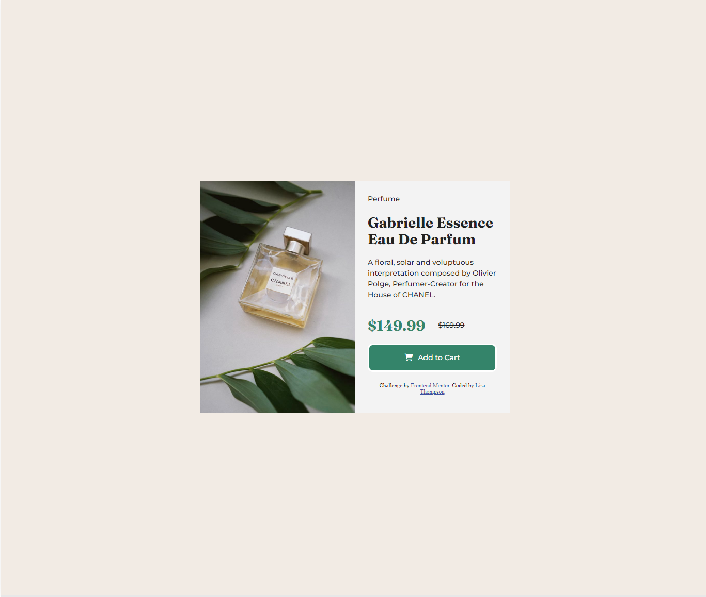

# Frontend Mentor - Product preview card component solution

This is a solution to the [Product preview card component challenge on Frontend Mentor](https://www.frontendmentor.io/challenges/product-preview-card-component-GO7UmttRfa). Frontend Mentor challenges help you improve your coding skills by building realistic projects. 

## Table of contents

- [Overview](#overview)
  - [The challenge](#the-challenge)
  - [Screenshot](#screenshot)
  - [Links](#links)
- [My process](#my-process)
  - [Built with](#built-with)
  - [What I learned](#what-i-learned)
  - [Continued development](#continued-development)
- [Author](#author)

## Overview

### The challenge

Users should be able to:

- View the optimal layout depending on their device's screen size
- See hover and focus states for interactive elements

### Screenshot





### Links

- Solution URL: [https://www.frontendmentor.io/solutions/responsive-card-using-flexbox-Q1c_gi3dQ4]
- Live Site URL: [https://lisacodesnow.github.io/product_preview_card/]


## My process

1. Broke the design comp into its own containers. Doing that not only allowed me to name my containers but to decide if I was going to use flexbox or css grid.
2. I used flexbox since alot of the elements were in column format. If it was a mix of columns and rows then I could've used grid or both.
3. Wrote html first, working out to in
4. Wrote css, working top to bottom

### Built with

- Semantic HTML5 markup
- CSS custom properties
- Flexbox
- Mobile-first workflow

### What I learned

1. How to break down a design comp and do alot of planning before writing a single code
2. How to use two different image tags for two different queries but only have one show up for one and the other show up for a different querie
This is for mobile querie
  ```css
      	.mobile-product-image{
		width: 100%;
	}
	
	.desktop-product-image{
		display: none;
	}

This is for desktop querie

.mobile-product-image{
		display: none;
	}
	
	.desktop-product-image{
		display: inline;
		width: 40%;
	}
  ```
Needed to add an inline display so image would show up


### Continued development

- I saw alot of people's solution use viewport height (vh). I had never used it and found it to be a struggle when adjusting my image heights. 
- Hopefully, I can figure it out and use it for a future project.
Use this section to outline areas that you want to continue focusing on in future projects. These could be concepts you're still not completely comfortable with or techniques you found useful that you want to refine and perfect.


## Author

- Frontend Mentor - [@lisacodesnow](https://www.frontendmentor.io/profile/lisacodesnow)


